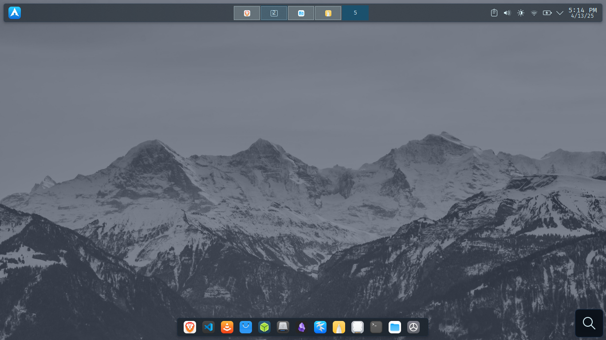
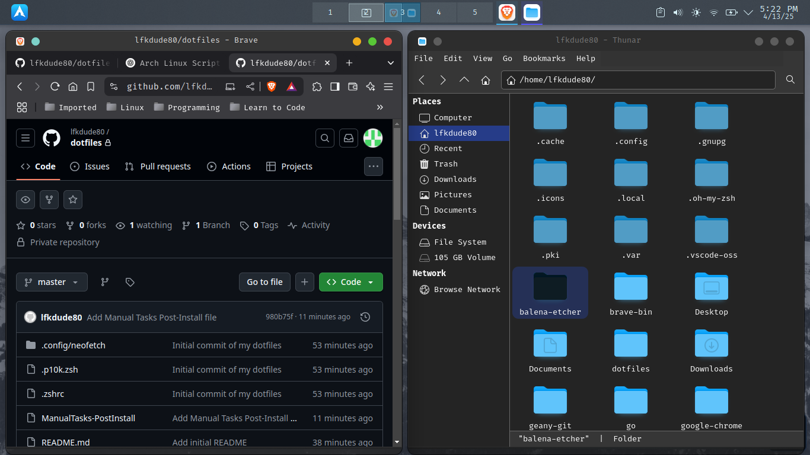
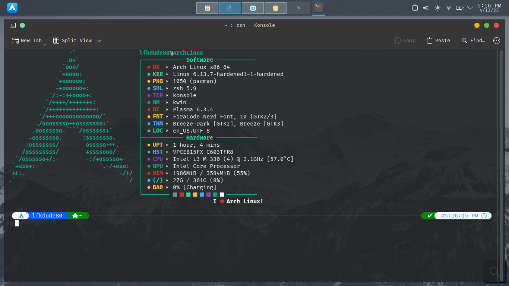
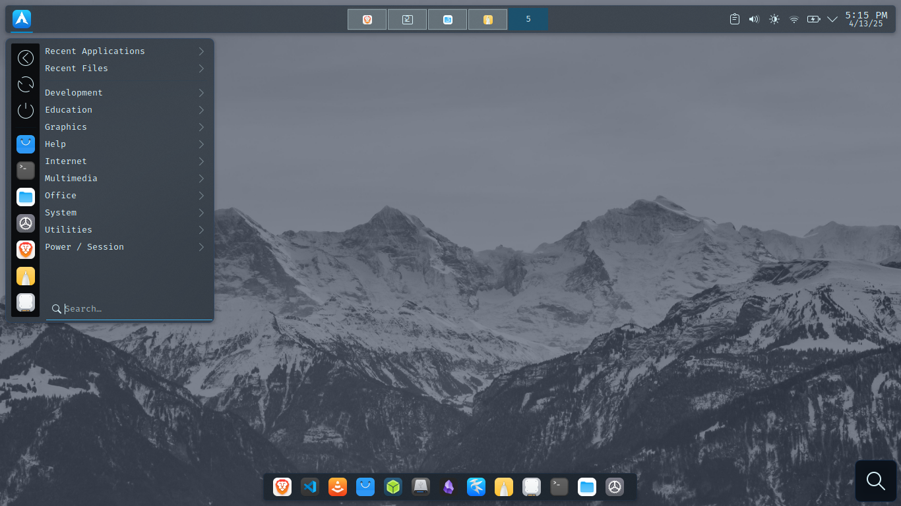

# 🎩 lfkdude80’s KDE Plasma Dotfiles

Welcome to my custom Arch + KDE Plasma setup! This repo contains everything you need to replicate my environment, including:
- Terminal-based post-install script
- Manually applied GUI tweaks
- Nerd Fonts setup
- My preferred apps and appearance settings

> 🧠 This guide is step-by-step. Follow each phase **in order** for best results.

---

## 📸 Screenshots

<p align="center">
  
  
  
  
</p>

---

## 🥉 1. Pre-Install Manual Setup (Important!)

### 🔁 Update Mirrors & System

On a fresh install, start with the basics:

```bash
sudo pacman -Syu reflector --noconfirm
sudo reflector --country 'United States' --latest 10 --fastest 10 --protocol https --sort rate --save /etc/pacman.d/mirrorlist
sudo pacman -Syu --noconfirm
```

### 🕋️ Nerd Fonts (Powerlevel10k + Terminal Icons)

Manually download the following fonts from:  
👉 [https://www.nerdfonts.com/font-downloads](https://www.nerdfonts.com/font-downloads)

Recommended Fonts:
- • FiraCode
- • JetBrainsMono
- • SauceCodePro
- • Hack
- • MesloLGL
- • Monofur
- • SpaceMono

Once downloaded:
```bash
mkdir -p ~/.local/share/fonts
mv ~/Downloads/*.ttf ~/.local/share/fonts/
fc-cache -fv
```

### 🛠️ Make the Script Executable

```bash
cd ~/dotfiles
chmod +x post-install.sh
```

---

## 🧪 2. Run the Post-Install Script

This script installs all my core terminal tools, Zsh config, AUR apps, and more.

### ▶️ Run it:

```bash
./post-install.sh
```

[View script here »](./post-install.sh)

---

## 🖼️ 3. Manual GUI Configuration

Now that your apps and shell are set up, it's time to polish the system using KDE's System Settings.

### 🧱 Krohnkite Tiling
- • Disable **Monocle Layout**
- • Set **Outer/Inner Gaps** to `10px`
- • Save layout via KDE settings if desired

### 🎨 Themes & Appearance
Go to `System Settings → Appearance` and apply:
- • **Global Theme:** `WhiteSur Dark`
- • **Plasma Style:** `Gently`
- • **Application Style:** `Breeze`
- • **Colors:** `WhiteSur-Dark`
- • **Icons:** `WhiteSur`
- • **Window Decorations:** `WhiteSur-Dark`
- • Optional wallpaper: `Nordic Mountain`

### 🔤 Fonts (GUI Side)
- • Set your default font to your chosen Nerd Font (MesloLGL is a great pick)
- • Adjust font hinting/anti-aliasing for your display

### 🌐 Default Applications
- • Set **Brave** as your browser
- • Choose your terminal of choice (e.g. Konsole, Kitty, or Alacritty)

---

## 🪼 Notes & Cleanup

- • After script completion, restart the terminal for Zsh changes to take effect.
- • `neofetch` is added to your `.zshrc` for fun.
- • Use `yay` for installing additional AUR packages.

---

## ✅ Final Result

A fast, clean, keyboard-friendly KDE environment tuned for development, productivity, and aesthetics.

