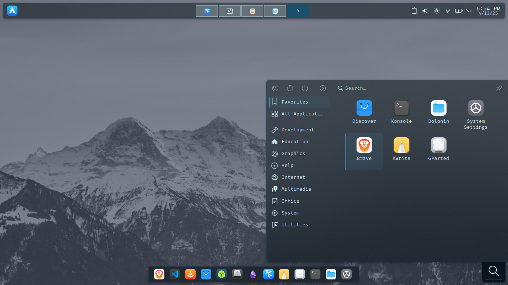

# lfkdude80’s KDE Plasma Post-Installation Customization Guide

Welcome to my custom Arch + KDE Plasma setup! I suggest downloading the ALCI ISO Hardened from this site: https://alci.online/download-or-build/ and install it via USB or in your favorite virtual machine. This GitHub repo contains everything you need to replicate my environment, including:
- Terminal-based post-install script
- Manually applied GUI tweaks
- Nerd Fonts setup
- My preferred apps and appearance settings

> This guide is step-by-step. Follow each phase **in order** for best results.

---

## Screenshots

<p align="center">
  
  
  
  
  
</p>

---

## 1. Pre-Install Manual Setup (Important!)

### Update Mirrors & System

After a clean installation, start with these commands FIRST:

```bash
sudo pacman -Syu reflector --noconfirm
sudo reflector --country 'United States' --latest 10 --fastest 10 --protocol https --sort rate --save /etc/pacman.d/mirrorlist
sudo pacman -Syyu --noconfirm
```

### Nerd Fonts (Powerlevel10k + Terminal Icons)

Manually download the following fonts from:  
👉 [https://www.nerdfonts.com/font-downloads](https://www.nerdfonts.com/font-downloads)

Recommended Fonts:
- FiraCode
- JetBrainsMono
- SauceCodePro
- Hack
- MesloLGL
- Monofur
- SpaceMono

Once downloaded:
- Find the .ttf files and move them into the right folder, probably ~/.local/share/fonts .
- Additionally, you can move them with the commands below. Double check the path for the .ttf files first.
```bash
mkdir -p ~/.local/share/fonts
mv ~/Downloads/*.ttf ~/.local/share/fonts/
fc-cache -fv
```

### Create a Folder & Make the Script Executable
Create a folder in your ~/ directory and call it "arch-kde-dotfiles". Download the script and any configurations you want to use and place them in that folder.
```bash
mkdir ~/arch-kde-dotfiles
cd ~/arch-kde-dotfiles
chmod +x post-install.sh
```
### Disclaimer: Swap File Setup
This script automatically creates a 2GB swap file to give your system a little extra snappiness — perfect for when memory gets tight or you're running heavier apps on older hardware.

Swap is enabled immediately and added to /etc/fstab so it stays active after reboot.

---

## 2. Run the Post-Install Script

This script updates the system, installs all of my core terminal tools, Zsh, AUR apps, and creates the swap file.

### Run it:

```bash
./post-install.sh
```

[View script here »](./post-install.sh)

---

## 3. Manual GUI Configuration

Now that your apps and shell are set up, it's time to polish the system using KDE's System Settings GUI app. Everything should be findable via Get New button on the upper right hand side of the window or found by searching. The Nordic mountain wallpaper is downloadable from the top of this page.

### Krohnkite Tiling
- Disable **Monocle Layout**
- Set **Outer/Inner Gaps** to `10px`
- Save layout via KDE settings if desired

### Themes & Appearance
Go to `System Settings → Appearance & Style` and click the Get New button. Download and apply these:
- **Global Theme:** `WhiteSur Dark`
- **Plasma Style:** `Gently`
- **Application Style:** `Breeze`
- **Colors:** `WhiteSur-Dark`
- **Icons:** `WhiteSur`
- **Window Decorations:** `WhiteSur-Dark`
- Optional wallpaper: `Nordic Mountain`

### Fonts
- Set your default font to your chosen Nerd Font (I like FiraCode)
- Adjust font hinting/anti-aliasing for your display

---

### Launch Zsh & Apply Your Dotfiles
Once the script finishes:

Open your terminal. Zsh will launch by default. If Powerlevel10k prompts you with its configuration wizard, feel free to exit or skip — you’ll be applying your own settings in a moment.

Clone the dotfiles repo (if not already):
```bash
git clone https://github.com/lfkdude80/arch-kde-dotfiles.git
cd arch-kde-dotfiles
```
Copy the Configuration Files
You can copy the Zsh configuration files using one of two methods:

Option 1: Quick Copy in the Terminal
```bash
cp .zshrc ~/.zshrc
cp .p10k.zsh ~/.p10k.zsh
cp /.config/neofetch/config.conf ~/.config/neofetch
```

Option 2: Manual Copy with Nano
Open each file in nano, then copy and paste the contents manually.
```bash
nano ~/.zshrc
```

Then open your local .zshrc from the dotfiles folder in a second terminal window or text editor, copy the contents, and paste them into nano.

Repeat the same process for .p10k.zsh:
```bash
nano ~/.p10k.zsh
```
Once done, save and exit (CTRL + O, then Enter, then CTRL + X).

Apply the Changes by Reloading Zsh Config
```bash
source ~/.zshrc
```
---

### Application Launcher on the KDE panel
- Left click and select Show Alternatives
- Select Application Menu
- Change the icon to the Arch Linux icon

### Application Launcher desktop widget
- Download the Simple Application Launcher widget 
- Right-clicking the panel > Add or Manage Widgets
- Add to the bottom right side of the desktop and shape accordingly

### Default Applications
- Set **Brave** as the default browser
- Set **Kwrite** as the default text editor
- Set **Thunar** as the default file manager
- Choose your terminal of choice (I use either Konsole or Alacritty)

---

### Dock
- Add a second KDE panel that will function as a dock
- Set **Position** to the bottom
- Set **Width** to Fill Content
- Set **Visibility** to Dodge Windows
- Set **Opacity** to Transluscent

---

## Notes & Cleanup

- Use `yay` for installing additional AUR packages.
- Either log out and back in, or reboot your computer just for good measure.
- Have fun customizing it and making it your own!

---

## Final Result

A fast, clean, keyboard-friendly KDE environment tuned for development, productivity, and aesthetics.
